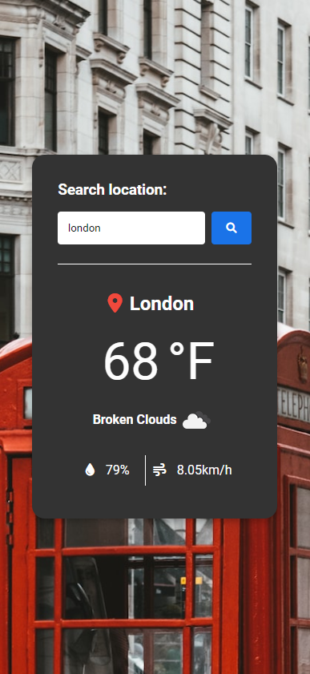
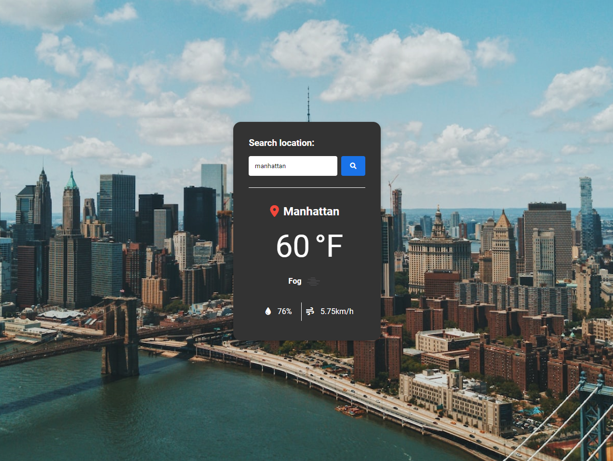

# weather-js

Weather JS

JavaScript project using the <a href="https://openweathermap.org/api/one-call-3">OpenWeather</a> and <a href="https://unsplash.com/developers">Unsplash</a> APIs.

<h2>Preview</h2>

